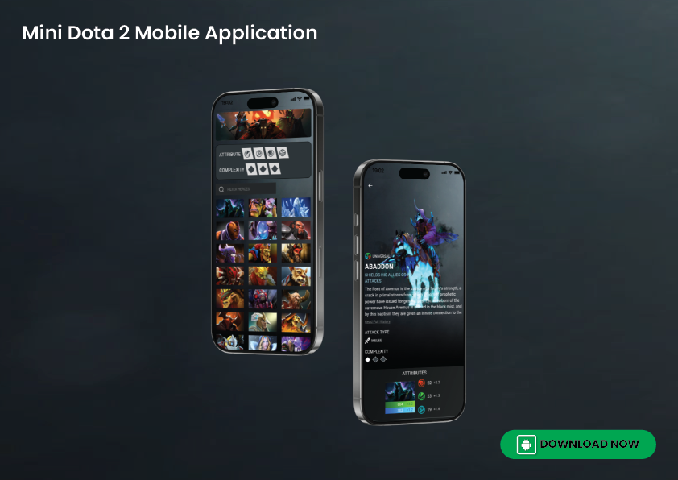

# dota2_app 
I make is project just for fun. I got the inspiration for the game called Dote 2 and decided to build this app for quick access to information about the game. 

# Tech Stack:
-	Flutter framework
-	Dart (shelf-package) for backend

# Resources Link:
- https://www.dota2.com/heroes

# Features 
- Display all heroes in the game including hero detail, state, and skill. 
- Show recommended Item build for each. (Not yet implemented) 
- Maybe display statistics about heroes, e.g.: hero-win-rate (Not yet implemented)

# Screenshots

## Getting Started

This project is a starting point for a Flutter application.

A few resources to get you started if this is your first Flutter project:

- [Lab: Write your first Flutter app](https://docs.flutter.dev/get-started/codelab)
- [Cookbook: Useful Flutter samples](https://docs.flutter.dev/cookbook)

For help getting started with Flutter development, view the
[online documentation](https://docs.flutter.dev/), which offers tutorials,
samples, guidance on mobile development, and a full API reference.
